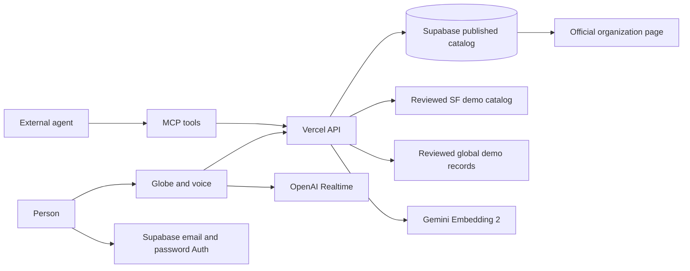

# Helios: an opportunity layer agents can use

## Job

A person asks an agent for a way to help. The agent needs current, attributable opportunities, a meaningful place, a realistic schedule, and the official next step. A list of names or a plausible answer cannot establish a place to volunteer, admission, or attendance.

Helios gives the agent a small published catalog of sourced public-benefit opportunities and returns a structured next action. The same result appears on a globe for the person. Voice search can move the globe to a returned record. The external organization controls registration. Helios does not claim that a visit to a link completed an application.

## Hackathon demonstration

1. Click Talk to Helios or the microphone. Helios asks how you want to help. Say "My Sunday is open. Where can I help with food in San Francisco?" If you say "near me" without a place, Helios asks for your city or country.
2. Helios shows Project Open Hand and St. Anthony Foundation: their official pages publish Sunday meal shifts. Neither record claims an open slot. Meals on Wheels SF is excluded because its FAQ says it has no weekend volunteer program.
3. Ask: "I have $10 to give." Project Open Hand appears first because its official form publishes a $10 minimum. Other donation paths are shown with their amount unverified.
4. Open the chosen organization’s official volunteer or donation page. Helios does not submit registration or payment. Call `search_opportunities` over MCP to get the same source, recurring days, action authority, and shareable globe link.
5. Open My actions to return to a saved path or create a Supabase email/password account. Discovery does not require an account. When the paid-AI gate is enabled, OpenAI Realtime can search, focus a record, list sourced needs, check an offer, and show a need card. Text search remains available when voice is disabled.
6. Open Needs. Inspect the sourced Food Bank Singapore signal or create a private need-card draft for organization review. Save an action and return to it from My actions. The trail never marks a click as participation or impact.

The local demo includes nine global catalog paths and 15 manually reviewed San Francisco organizations. When Supabase is configured, the server combines its published records with the SF catalog. Coverage is intentionally limited and no record confirms current shift capacity. A published recurring day is a lead to verify, not a dated event listing.

## Agent contract

- `POST /api/mcp`: read-only MCP tools `describe_catalog`, `search_opportunities`, `get_opportunity`, `list_sourced_needs`, `get_sourced_need`, and `check_offer`.
- `GET /api/agent`: machine-readable endpoint inventory and authority boundary.
- `GET /api/catalog`: published records for the globe.
- `POST /api/search` with `{ "query": "...", "country": "Singapore" }`: search results plus the actual search mode and catalog scope.
- `GET /api/needs`: published partner cards and reviewed public signals with their source checks and review dates.
- `list_sourced_needs`, `get_sourced_need`, and `check_offer` over MCP: discover and read the same need, then assess a proposed offer without claiming provider acceptance.

Every agent record includes an official source URL and check time, map coordinates with pin meaning, a shareable globe `view_url`, schedule text when available, explicit availability status, and a typed next action with a provider-specific note. `not_started` means Helios has not performed an external action. `provider_confirmation` means a provider receipt is needed before claiming completion. `describe_catalog` reports the limited country coverage so agents can distinguish an empty catalog match from no opportunity existing.

The Connect agents panel makes real MCP requests from two named clients. The discovery client rejects the wrong Lakewood date and passes the returned record ID to the evidence client, which reads the same source and official action. This is a deterministic handoff, not autonomous agent collaboration or provider action.

## System

Supabase holds records with RLS and pgvector. Gemini generates 768-dimensional retrieval embeddings when its server key is configured and the catalog rows have been embedded. The API reports `keyword` until semantic retrieval actually runs. OpenAI Realtime only receives short-lived client secrets; its tools call the same search API and focus a returned ID. The MapLibre globe uses NASA GIBS Blue Marble imagery from August 2004, with attribution in the map.

Supabase Compute is private alpha and is outside this demo's critical path. Bedrock agent loops and Stripe payments are not connected. There is no honest payment step in finding a volunteer role; adding a checkout only to satisfy a sponsor category would confuse the user's job. A separate, organization-owned [Stripe donation flow](STRIPE_DONATION_FLOW.md) is specified, but no recipient link or checkout is verified. A provider receipt and readback are required before Helios claims payment.

## Evidence and limits

- Prior Supabase migration and readback: nine published records, nine sourced records, one RLS policy, pgvector installed, search function installed. This is historical proof for the earlier catalog.
- Current TypeScript and Vite build: passed locally; 17 focused feasibility, catalog, and need-assessment tests passed.
- Current local rendered path: the Needs sheet opened the reviewed public signal; the draft form rendered before sign-in; a saved need appeared in My actions and its return link reopened the same need. `food bank near me` showed location unknown with zero results; `help children learn in Kenya` returned no out-of-place catalog result.
- Current rendered local path: 24 sourced records across nine country labels, including 15 San Francisco records. A Sunday food request returned two SF programs; a $10 gift request returned six official donation paths, with a verified minimum only for Project Open Hand.
- Proactive browser demo: clicking Talk to Helios showed the greeting, and a typed Sunday reply returned two source-backed records. Browser speech recognition and audio output remain browser-dependent.
- Full local API: `/api/catalog` returned 24 records; `/api/search` returned global, Sunday, and $10 results; `/api/auth-config` reported the existing Supabase connection; `/api/voice-token` returned a short-lived token. Supabase Auth settings reported email signup enabled and email confirmation required. The Account panel enabled signup. A new external user was not created during verification.
- Prior protected Vercel preview: catalog returned nine sourced records; MCP initialize, tool listing and search responded with structured next actions. The new San Francisco catalog has not yet been deployed or read back there.
- Local rendered desktop and phone paths: Lagos search produced one result, globe focus and official action; an unmatched query showed a clear empty state and zero markers.
- Semantic retrieval: unverified until the Gemini key is configured and document embeddings are stored.
- OpenAI Realtime speech: token issuance worked in an earlier gated test, but the in-app browser did not complete microphone capture. The current interface uses a dock glow and no voice popup or browser-speech fallback. A spoken end-to-end Realtime search remains unverified.
- Supabase signup: UI and configuration are wired; an actual signup and email confirmation remain unverified until a test identity completes the provider flow.
- Registration, admission, payment, attendance: not implemented; external provider authority.
- Need quantity, offer acceptance, and delivery to a recipient: unverified. The sourced need is a manually reviewed hackathon seed, not a live partner request.
- Small Steps Foundation is a prospective first contact, not a partner. Its public website does not establish a specific Helios need, so no card is published on its behalf.
- The personal action trail is stored only in this browser. Provider acknowledgement and participation are not integrated.
- The partner need-card migration passed a linked dry run but was not applied. Authenticated draft persistence and partner publication are UNVERIFIED live.

This is agent-useful because agents can act on a typed, attributable next step and stop at the real authority boundary. The individual techniques existed earlier; the product claim is the integrated, verifiable workflow, not a claim that the software was literally impossible a year ago.
