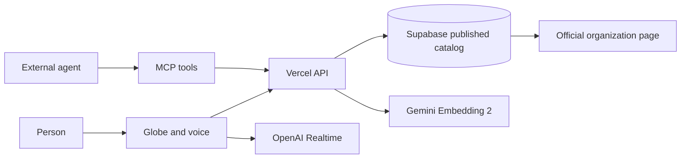

# Helios: an opportunity layer agents can use

## Job

A person asks an agent for a way to help. The agent needs current, attributable opportunities, a meaningful place, a realistic schedule, and the official next step. A list of names or a plausible answer cannot establish a place to volunteer, admission, or attendance.

Helios gives the agent a small published catalog of sourced public-benefit opportunities and returns a structured next action. The same result appears on a globe for the person. Voice search can move the globe to a returned record. The external organization controls registration. Helios does not claim that a visit to a link completed an application.

## Hackathon demonstration

1. Ask: "Find food relief volunteering in Lagos."
2. Helios returns an official-source record with the checked date, map pin meaning, and a `visit_official_page` next action.
3. Select the record. The globe flies to Lagos and shows the official page.
4. Ask the voice agent to find another opportunity and fly to it, if OpenAI Realtime is configured.
5. Call the same `search_opportunities` tool over MCP from an agent client.

The public demo catalog contains nine manually reviewed records across eight countries and one global online program. It is intentionally small. It is not a worldwide index and does not confirm that any role still has open capacity. Each record links to the organization so a person can verify availability.

## Agent contract

- `POST /api/mcp`: read-only MCP tools `search_opportunities` and `get_opportunity`.
- `GET /api/agent`: machine-readable endpoint inventory and authority boundary.
- `GET /api/catalog`: published records for the globe.
- `POST /api/search` with `{ "query": "..." }`: search results plus the actual search mode.

Every agent record includes an official source URL and check time, map coordinates with pin meaning, schedule text when available, and a next-action state. `not_started` means Helios has not performed an external action. `provider_confirmation` means a provider receipt is needed before claiming completion.

## System

Supabase holds records with RLS and pgvector. Gemini generates 768-dimensional retrieval embeddings when its server key is configured and the catalog rows have been embedded. The API reports `keyword` until semantic retrieval actually runs. OpenAI Realtime only receives short-lived client secrets; its tools call the same search API and focus a returned ID. The MapLibre globe uses public demo tiles in this build.

Supabase Compute is private alpha and is outside this demo's critical path. Bedrock agent loops and Stripe payments are not connected. There is no honest payment step in finding a volunteer role; adding a checkout only to satisfy a sponsor category would confuse the user's job. If a future organization authorizes a paid event or donation flow, the provider receipt must be modeled and read back before Helios claims admission or payment.

## Evidence and limits

- Live Supabase migration and readback: nine published records, nine sourced records, one RLS policy, pgvector installed, search function installed.
- TypeScript and Vite build: passed locally.
- Protected Vercel preview: catalog returned nine sourced records; MCP initialize, tool listing and search responded with structured next actions. The rendered desktop path showed a Lagos search, one Lagos result, a globe flight and the official link.
- Semantic retrieval: unverified until the Gemini key is configured and document embeddings are stored.
- Voice: unverified until the OpenAI key is configured and a browser session completes a search.
- Registration, admission, payment, attendance: not implemented; external provider authority.

This is agent-useful because agents can act on a typed, attributable next step and stop at the real authority boundary. The individual techniques existed earlier; the product claim is the integrated, verifiable workflow, not a claim that the software was literally impossible a year ago.
